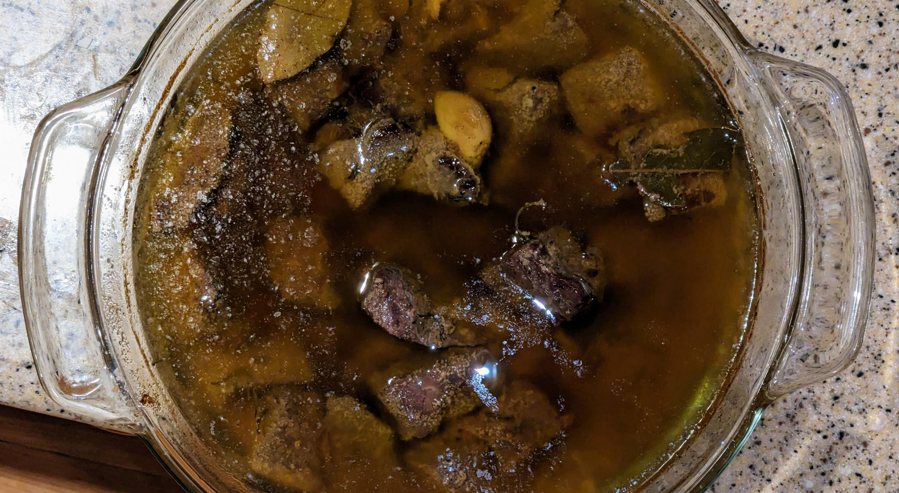

Confit is a traditional French method of slow-cooking meat in fat at a low temperature, allowing tough collagen to break down into soft gelatin and producing exceptionally tender, easily digestible meat.

### Ingredients

- 2 lbs beef stew meat cut into even chunks, or just ground beef
    
- 1 tbsp salt
    
- Freshly ground black pepper
    
- Optional: garlic cloves, thyme, rosemary, bay leaf
    
- Enough fat (coconut oil, beef tallow, or olive oil) to fully submerge the meat 
    

### Instructions:

1. **Dry Brine (Recommended):**  Salt the meat evenly and refrigerate uncovered for 2–12 hours. This deepens flavor and improves texture. Add pepper and optional herbs just before cooking.
    
2. **Submerge in Fat:** Place meat and seasonings in an oven-safe pot or Dutch oven. Pour in melted fat to fully cover the meat.
    
3. **Slow Cook:** Cover and cook in the oven at 225°F (107°C) for 4-5 hours, until fork-tender.
    
4. **Crisp (Optional):** For texture contrast, sear the cooked meat briefly in a hot skillet before serving.
    
5. **Storage:** Let it cool slightly, then lift the meat from the fat. A layer of flavorful, gelatinous juices will have settled beneath it. Separate these from the fat and use them as a rich broth or sauce. The fat can be served with the meat or reserved for future confit or cooking.

### Nutrition Information (oil excluded)

- **Protein:** 200g

