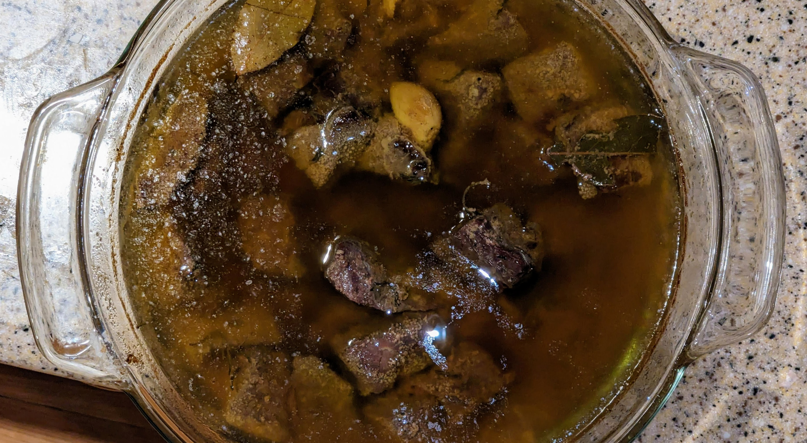

油封（Confit）是一种传统的法式慢煮技法：在低温下用油脂长时间烹调肉类，使坚韧的胶原蛋白分解成柔软的明胶，最终得到异常嫩滑、易于消化的肉质。

---

### 食材

- 牛肉块约 900 克（切成均匀小块，或直接用绞牛肉）
    
- 食盐 1 汤匙
    
- 现磨黑胡椒适量
    
- 可选：整瓣蒜、百里香、迷迭香、月桂叶
    
- 足量脂肪（椰子油、牛油或橄榄油），可完全淹没肉
    

---

### 制作步骤

1. **干腌（推荐）**：将盐均匀撒在肉上，放入冰箱冷藏、敞开放置 2–12 小时。这样能提升风味、改善口感。烹调前加入黑胡椒和香草。
    
2. **浸脂**：将肉和调味料放入耐烤锅（如铸铁锅）。倒入融化的油脂，完全覆盖肉。
    
3. **慢煮**：盖上锅盖，放入烤箱，以 107°C（225°F）烹调 4–5 小时，直至肉质软嫩，用叉子即可轻易戳穿。
    
4. **煎脆（可选）**：为增加口感层次，可在上桌前用热锅快速煎脆外层。
    
5. **储存**：稍微冷却后取出肉。锅底会分出一层富含风味的胶状汁液，可与油脂分离——汁液可用作浓汤或酱汁；油脂可与肉同食，或留作下次烹调使用。
    

---

### 营养信息

- **蛋白质**：约 200 克

