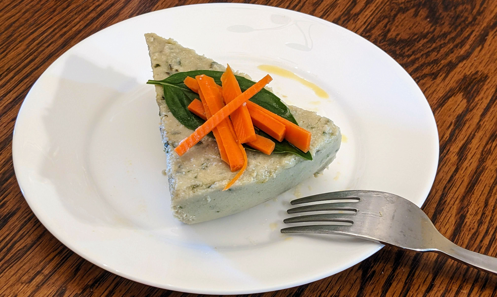

A smooth, herb-infused chicken terrine with a 2:1 fat-to-protein ratio. Fresh basil and rosemary add aroma and help limit oxidation. The chicken itself works as a natural emulsifier, creating a silky texture that supports digestion and delivers balanced, keto-friendly calories. A reliable staple that covers your macros and keeps your gut happy.

### Ingredients

- 1.2 lb lean ground chicken
    
- 1 cup fat (butter, olive oil, high-oleic sunflower oil, or a mix)

- 1 tbsp of olive oil
    
- 1 cup fresh basil leaves, loosely packed
    
- 1 tbsp unflavored gelatin
    
- ¼ cup apple cider vinegar
    
- Salt & freshly ground pepper, to taste
    
- 5 sprigs fresh rosemary (or as much as you like, for preventing chicken oxidation)
    
- 1/4 cup cold water (for blooming gelatin)
    
- 1/2 cup warm water or light rosemary chicken broth (for blending)

### Method

1. **Season the Chicken:**  In a large bowl, combine ground chicken with salt, pepper, and a 1 tbsp of olive oil. Mix well, then shape into large balls about 3 inches in diameter.
    
2. **Prepare Rosemary Poaching Liquid:** In a pot, simmer water with the rosemary sprigs for about 5 minutes to infuse.
    
3. **Poach the Chicken Balls:** Gently lower the chicken balls into the rosemary water. Poach at a gentle simmer for about 20 minutes, or until the internal temperature reaches **160°F (71°C)**. Remove and let cool slightly.
    
4. **Melt the Fat:**  If using butter, melt **8 oz (1 cup)** over low heat until fully liquid. 
    
5. **Bloom the Gelatin:** In a small bowl, sprinkle gelatin over **1/4 cup cold water** and let sit for 1 minute.
    
6. **Blend the Terrine:** In a high-speed blender or food processor:
    
    - Add the poached chicken, apple cider vinegar, extra salt and pepper, and **½ cup warm water or rosemary broth**. Blend until partly smooth.
        
    - Pour in the melted fat and continue blending.
        
    - Add the basil leaves and blend again until very smooth.
        
    - Finally, add the bloomed gelatin and blend one last time until fully incorporated.
        
7. **Set and Chill:** Transfer the mixture into a loaf pan, terrine mold, or a simple glass container. Smooth the top, cover with a lid or plastic wrap, and refrigerate for at least 4 hours, until firm.
    
8. **Serve**: Slice or scoop and serve cold — as a complete meal or paired with side vegetables such as grilled peppers.
    

### Nutrition Information

- **Calories:** 2530
    
- **Fat:** 230g
    
- **Protein:** 110g
    
- **Net Carbs:** 5g

