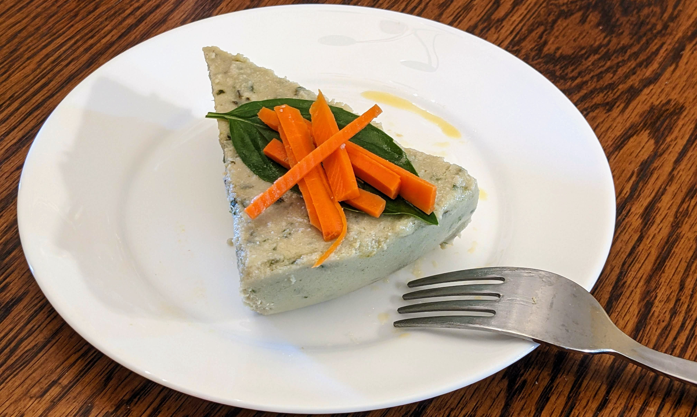

一款细腻、带草本香气的鸡肉肉冻，脂肪:蛋白约为2:1。新鲜罗勒与迷迭香增香并帮助减缓氧化。鸡肉本身起到天然乳化作用，形成丝滑质地，易于消化，热量配比适合生酮饮食。可作常备菜，覆盖宏量营养需求并让肠胃更舒适。

### 配料

- 1.2 磅去脂鸡绞肉（约 545 克）
    
- 1 杯脂肪来源（黄油、橄榄油、高油酸葵花籽油或混合，约 240 毫升）
    
- 橄榄油 1 汤匙（约 15 毫升）
    
- 新鲜罗勒叶 1 杯（松装）
    
- 无味明胶粉 1 汤匙（约 10 克）
    
- 苹果醋 1/4 杯（约 60 毫升）
    
- 盐与现磨黑胡椒 适量
    
- 新鲜迷迭香 5 枝（或按需，多用有助于减少鸡肉氧化）
    
- 冷水 1/4 杯（约 60 毫升，用于泡发明胶）
    
- 温水或清淡迷迭香鸡汤 1/2 杯（约 120 毫升，用于搅拌）
    

### 做法

1. **给鸡肉调味：** 在大碗中将鸡绞肉、盐、黑胡椒与 1 汤匙橄榄油拌匀。搓成直径约 7–8 厘米的大肉丸。
    
2. **制备迷迭香浸液：** 锅中加水与迷迭香，小火煮约 5 分钟以释出香气。
    
3. **水煮鸡肉丸：** 将肉丸轻放入迷迭香水中，小火微沸水煮约 20 分钟，或至中心温度 **71°C（160°F）**。取出稍放凉。
    
4. **融化脂肪：** 如用黄油，低火加热至完全融化 **8 盎司（约 1 杯）**。
    
5. **泡发明胶：** 明胶撒在 **1/4 杯冷水**上，静置 1 分钟。
    
6. **搅拌成糊：** 用高速搅拌机或料理机：
    
    - 放入水煮鸡肉、苹果醋、适量盐和黑胡椒，加 **1/2 杯温水或鸡汤**，先搅至半顺滑。
        
    - 逐渐倒入融化的脂肪，继续搅拌。
        
    - 加入罗勒叶，搅拌至非常顺滑。
        
    - 最后加入泡发好的明胶，再次搅拌至完全融合。
        
7. **定型冷藏：** 倒入吐司模、肉冻模或耐热玻璃盒，抹平表面，加盖或包保鲜膜，冷藏至少 4 小时至凝固。
    
8. **食用：** 冷食。可切片或用勺取食，单独食用或配烤甜椒等蔬菜。
    

### 营养信息（整份）

- **能量：** 2530 千卡
    
- **脂肪：** 230 克
    
- **蛋白质：** 110 克
    
- **净碳水：** 5 克

