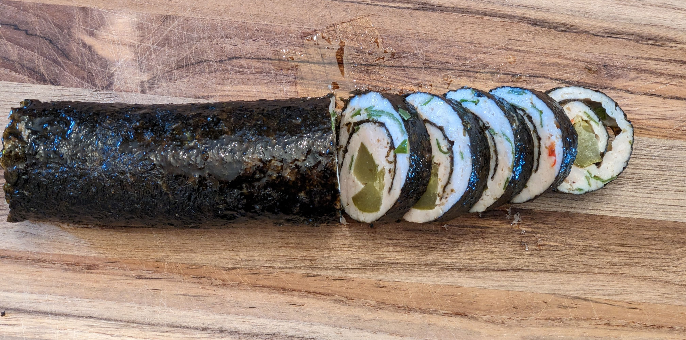

This is a no-carb fusion of meat rolls and sushi. Chicken works especially well, but turkey, pork, or beef can be used. It’s easier to make than sushi, since the chicken mixture is naturally sticky and holds the roll together. The recipe has a fat-to-protein ratio slightly over 1:1, but pairing with a fatty sauce or a keto side dish makes it a richer keto meal. For extra pungentness, wasabi or Colman’s English mustard work great.

### Ingredients

- 1.2 lb lean ground chicken
    
- ½ cup olive oil
    
- Salt and pepper
    
- 3 nori sheets
    
- Fermented carrots, beets, or palm hearts (for filling)
    
- Fresh cilantro or parsley
    
- Optional: chili flakes
    

### Instructions

1. Preheat oven to 375°F (190°C).
    
2. Mix chicken, oil, salt, pepper, herbs, and spices in a bowl.
    
3. Divide into 3 portions.
    
4. Spread one portion evenly over a nori sheet.
    
5. Place fermented vegetables along one edge and roll tightly.
    
6. Lay seam-side down in a baking dish.
    
7. Repeat with the remaining portions.
    
8. Bake 15–20 min, until chicken is cooked through.
    
9. Let rest 10 min so the chicken reabsorbs the oil, leaving a flavorful sauce.
    
10. Slice like sushi. Serve warm or cold. 

### Nutrition Information

- **Calories:** 1442
    
- **Fat:** 110g
    
- **Protein:** 110g
    
- **Net Carbs:** 3g

