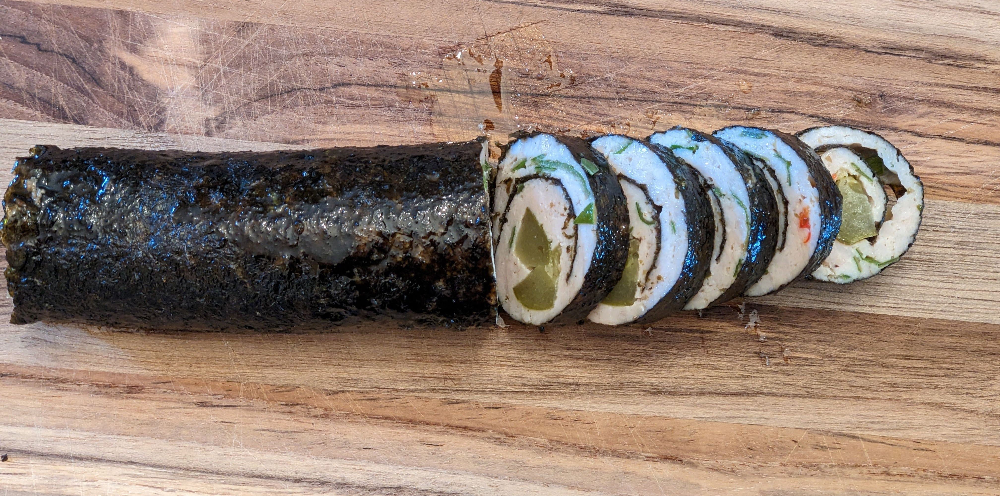

这是一款将肉卷与寿司融合的零碳水做法。鸡肉最适合，也可用火鸡、猪肉或牛肉。比寿司更易做，因为鸡肉糊自带黏性，容易成型。脂肪:蛋白略高于 1:1，若配高脂酱或生酮配菜，整餐更生酮。想要更强烈的辛辣刺激，可用山葵或 Colman’s 英式芥末。

### 配料

- 1.2 磅去脂鸡绞肉（约 545 克）
    
- 橄榄油 1/2 杯（约 120 毫升）
    
- 盐与黑胡椒 适量
    
- 海苔片 3 张（nori）
    
- 发酵蔬菜作内馅：发酵胡萝卜、甜菜或棕榈芯
    
- 新鲜香菜或欧芹
    
- 可选：辣椒碎
    

### 做法

1. 烤箱预热至 375°F（190°C）。
    
2. 碗中混合鸡肉、橄榄油、盐、黑胡椒、香草与香料。
    
3. 分成 3 份。
    
4. 取一份均匀铺在一张海苔上。
    
5. 沿一侧放入发酵蔬菜，紧紧卷起。
    
6. 卷口朝下放入烤盘。
    
7. 其余两份重复。
    
8. 烘烤 15–20 分钟，至鸡肉熟透。
    
9. 静置 10 分钟，让鸡肉回吸油脂，盘中留成风味酱汁。
    
10. 像寿司一样切段。可温食或冷食。
    

### 营养信息（整份）

- 能量：1442 千卡
    
- 脂肪：110 克
    
- 蛋白质：110 克
    
- 净碳水：3 克

