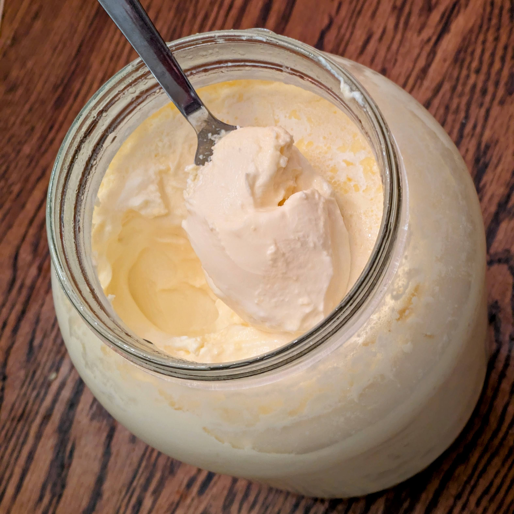

### 自制发酵奶油奶酪（3.8升大份量）

奶油奶酪浓郁百搭，是生酮饮食的常备食材。可以用来拌酸奶、做生酮芝士蛋糕，或者搭配西芹、黄瓜、鸡蛋、烟熏三文鱼。市售奶油奶酪如果吃得多，花费不小。下面这个配方教你用1加仑（3.8升）的原料在家轻松制作发酵奶油奶酪。

#### 原料

* 高脂稀奶油 3.5升（约7.5品脱）
* 活菌型奶油奶酪发酵剂 15毫升（1汤匙）
* 盐 45克（约3汤匙，用手抓一大把即可；我用喜马拉雅粉盐 + 可选钾盐）

#### 工具

* 1个洗净消毒的1加仑玻璃罐（带盖）
* 搅拌碗
* 勺子或打蛋器
* 烤箱或温暖发酵空间（约38°C）

#### 做法

1. 取一小部分高脂稀奶油与15毫升发酵剂在碗中混合，搅拌至基本顺滑、均匀。
2. 先将盐放入干净玻璃罐中。
3. 倒入高脂稀奶油至罐子一半高，充分搅拌使盐完全溶解。
4. 待盐稀释后，再加入发酵剂混合物——这样能避免高盐环境刺激或杀死微生物。
5. 倒入剩余的高脂稀奶油，几乎加满罐子。
6. 彻底搅拌均匀，确保所有原料混合充分。
7. 盖紧已消毒的干净盖子。卫生至关重要——长时间发酵容易滋生杂菌。
8. 将玻璃罐放入约38°C的烤箱（或温暖发酵环境中）。
9. 发酵约2天。若喜欢更浓烈、更酸的风味，可延长发酵时间。
10. 发酵完成后，放入冰箱冷藏，冷却后即可食用。

#### 小贴士

* 不同品牌的发酵剂可能带来风味和质地的细微差异。
* 发酵时间越长，酸味越重。
* 由于高脂肪、高盐、高酸度以及活性菌的存在，只要操作过程干净卫生，这款自制奶油奶酪在冷藏条件下可以保存很久。

#### 整批营养信息（仅供参考）

* 蛋白质：200克
* 脂肪：1600克

