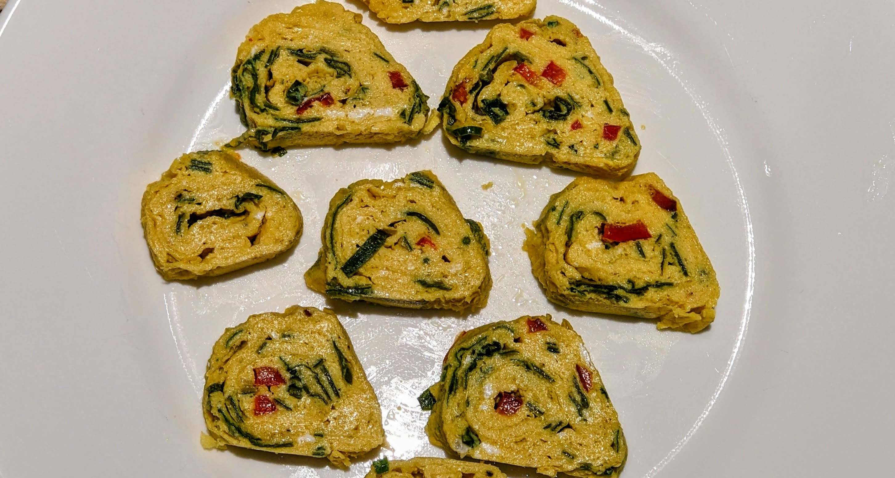

### Ingredients

- 4 large eggs
- 1 tbsp heavy cream
- 1 tbsp (wine or apple cider) vinegar 
- 1 tsp of salt
- 1 tsp soy sauce (optional)
- Olive oil for the pan
- Fresh herbs: scallions, parsley and/or cilantro
- Spices (optional): black pepper, spicy pepper flakes

### Instructions

1. **Mix Eggs**: Beat the eggs gently (don’t foam). Stir in heavy cream, soy sauce, vinegar, salt and fresh herbs

2. **Heat Pan**: Use a non-sticky pan. Heat over medium and oil it lightly. Tip: you can cook scallions lightly in the pan first, then add it to the egg mixture. 

3. **Cook in Layers**:

	- Pour a thin layer of egg mixture into the pan. Tilt to spread.
	- When it’s mostly set but still soft on top, roll it from one end to the other with chopsticks or a spatula.
	- Push the roll to one side, and pour in more egg mixture. 
	- Repeat until all egg is used.
 
4. **Cool and Slice**: Let it cool slightly, then slice into rolls.

### Notes

- Serve warm or cool, more vinegar can be added on top.

