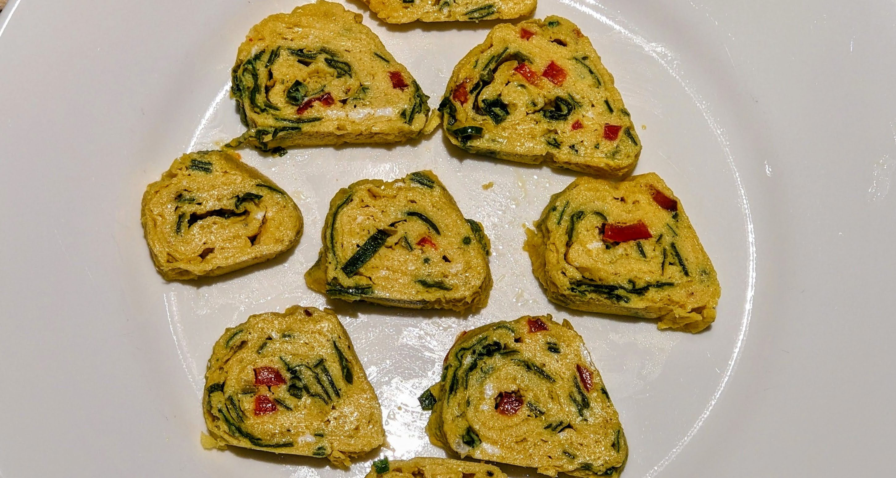

这款以日式玉子烧为灵感的生酮鸡蛋卷，薄层小火慢煎并层层卷叠，质地柔嫩易消化；以淡奶油、少量调味与新鲜香草提味，清爽不腻，做法简单而精致，适合早餐或咸味加餐。

### 配料

- 大鸡蛋 4 枚
    
- 淡奶油 1 汤匙（约 15 毫升）
    
- 醋 1 汤匙（葡萄酒醋或苹果醋）
    
- 盐 1 茶匙
    
- 酱油 1 茶匙（可选）
    
- 橄榄油（用于抹锅）
    
- 新鲜香草：葱、欧芹 和/或 香菜
    
- 香料（可选）：黑胡椒、辣椒碎
    

### 做法

1. **拌蛋液：** 轻轻打散鸡蛋，不要打出泡沫。加入淡奶油、酱油、醋、盐与切碎香草，搅匀。
    
2. **加热锅：** 选用不粘锅，中火加热并薄薄抹油。提示：可先在锅中把葱略炒后再拌回蛋液。
    
3. **分层煎卷：**
    
    - 倒入一层薄薄的蛋液，转动锅使其铺匀。
        
    - 底部基本凝固、表面仍略湿时，用筷子或铲子从一端卷起。
        
    - 将蛋卷推至一侧，锅面再抹少许油，倒入下一层蛋液，让蛋液流到卷的边缘下方后继续卷起。
        
    - 重复至蛋液用完。
        
4. **食用：** 稍放凉后切段。可温食或冷食。可再淋少量醋，或配酸味配菜，如发酵腌菜。
    

### 营养信息（整份）

- **能量：** 375 千卡
    
- **脂肪：** 30 克
    
- **蛋白质：** 25 克
    
- **净碳水：** 1 克

