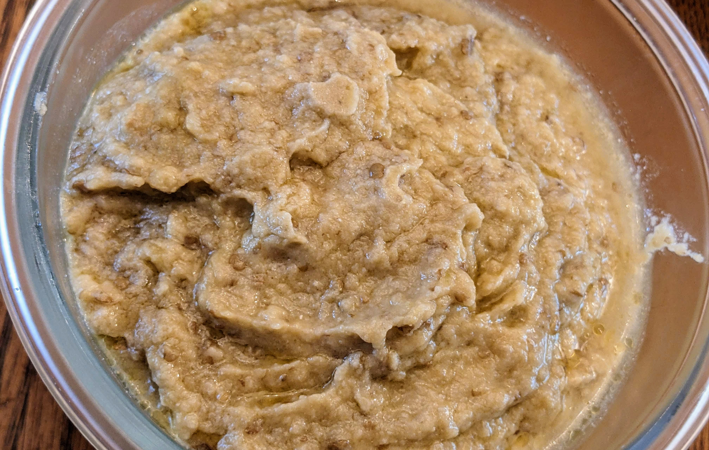

生酮茄子酱（温和版 baba ganoush）：以中东经典为灵感，配方更易消化。去掉芝麻酱与大蒜，用充足橄榄油获得浓郁顺滑而不厚重的口感。茄子天然纤维起乳化作用，使油脂与风味融合，细腻不油腻。富含膳食纤维与抗氧化物。可作蘸酱、配菜，或浇在肉类上。

### 配料

- 中等茄子 2 个
    
- 特级初榨橄榄油 1 杯，或高油酸葵花籽油（约 240 毫升）
    
- 新鲜香草碎 1–2 汤匙（欧芹、香菜或莳萝）
    
- 新鲜柠檬汁或苹果醋 1–2 汤匙（按口味）
    
- 盐 适量
    
- 可选：希腊酸奶或奶油奶酪 1/2 杯（更绵密）
    
- 可选：小茴香粉或烟熏红椒粉 1/4 茶匙（耐受者使用）
    

### 做法

1. **烤茄子：** 烤箱预热至 425°F（220°C）。茄子用叉子扎孔，表面薄刷油，整只烤 50–60 分钟，至表皮起皱、内部软嫩。
    
2. **放凉沥汁：** 略放凉后剖开取出果肉，放入滤网沥 10–15 分钟以除去多余水分。
    
3. **搅拌：** 将茄子肉与橄榄油、柠檬汁或苹果醋、盐、香草及可选香料搅拌成泥；若用酸奶或奶油奶酪，最后加入并拌匀以更顺滑。
    
4. **调味：** 视需要增减盐、油或酸度，调整风味平衡。
    
5. **食用：** 装碗，表面点缀新鲜香草。可配烤肉，淋在烤蔬菜上，或作蔬菜蘸酱。
    
6. **保存：** 冷藏可存放 5 天，隔夜更入味。

### 营养信息（整份）

- **能量：** 2152 千卡
    
- **脂肪：** 220 克
    
- **蛋白质：** 11 克
    
- **净碳水：** 32 克

