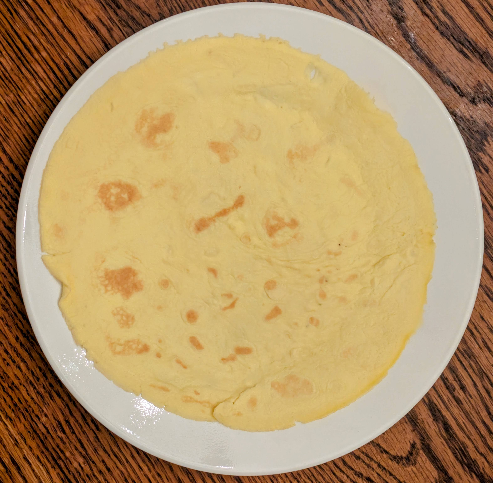

Frepe is the classic French crepe stripped down to keto essentials: eggs and butter only, blended into a smooth, fully emulsified batter. The result is a flexible, crepe-like sheet with a fat-to-protein ratio of about 3:1—a convenient, versatile, delicious keto staple. Use them as wraps, noodle substitutes, or a high‑fat side.

### Ingredients (Makes ~ 9-10 frepes)

- 12 large eggs  
- 8 oz (1 cup / 227 g) salted butter  

*(If using unsalted butter, add ½–1 tsp salt to taste.)*

### Instructions

1. **Melt the butter**  
   - In a small pot or pan over low heat, melt the butter gently.  
   - Let it cool for 1–2 minutes so it’s warm, not sizzling.

2. **Blend the batter**  
   - Crack all the eggs into a tall container or blender jar.  
   - Pour in the melted butter.  
   - Blend with a hand blender (or regular blender) until completely smooth and **fully emulsified**. The mixture should look uniform and slightly frothy, with no oily layer on top.

3. **Preheat the pan**  
   - Place a non-stick pan (mine is 12 inch) over medium-low heat.  
   - Optional: add a small amount of butter and swirl to coat.

4. **Cook the first frepe**  
   - Give the batter a quick stir (it can separate as it sits).  
   - Using a ladle, pour in just enough batter to form a thin, even layer that coats the bottom of the pan when you swirl it.  
   - Let it cook until the surface looks set and the edges lift easily (about 30–60 seconds, depending on heat).  
   - Reduce the heat if it browns too quickly.

5. **Flip and finish**  
   - Gently loosen the edges with a spatula.  
   - Flip the frepe and cook the second side for about 10 seconds.  
   - Slide it onto a plate.

6. **Repeat**  
   - Stir the batter briefly before each new frepe.  
   - Continue cooking until all the batter is used.  
   - Yields about 9–10 thin frepes from a 12‑inch pan.

### How to Use Frepes

- Wraps for meats, cheese, avocado, or sautéed low‑carb veggies
- Sliced into thin “noodles” for soups or stir‑fries

### Storage

- Stack the frepes and cover with a plate, or store in an airtight container.
- They keep for up to 1 week.
- Eat cold, warm in a pan with a little butter, or microwave gently before serving.
  
### Total Nutrition Information

- **Calories:** 2490
    
- **Fat:** 244g
    
- **Protein:** 77g
    
- **Net Carbs:** 4g

