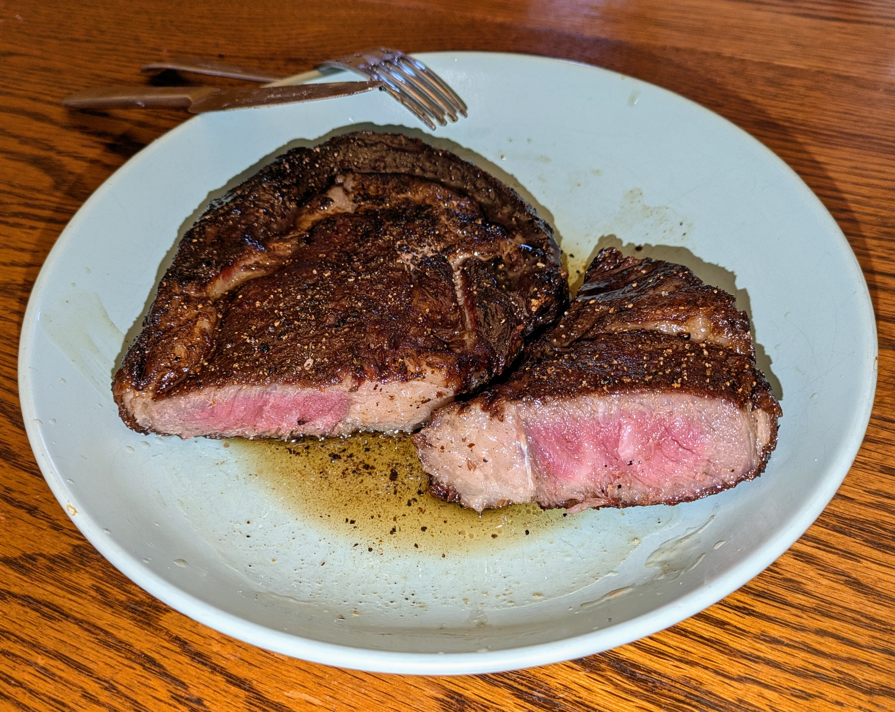

Simple, low-effort ribeye: dry-brined in the fridge, then reverse-seared. You get a crispy crust, buttery, reddish interior, zero carbs, and maximum flavor from minimal ingredients. With a final knob of butter, the fat-to-protein ratio exceeds 1.5:1.

### Ingredients

- 1 ribeye steak, 1.5 inches thick
    
- Salt and freshly ground black pepper
    
- 2 tbsp avocado oil
    
- Butter (or herbed compound butter), for serving

### Instructions

1. **Fridge “Dry-Age”**
    
    - Pat the steak very dry with paper towels.
        
    - Season both sides generously with salt and pepper.
        
    - Place the steak on a wire rack set over a tray to catch any drips.
        
    - Refrigerate **uncovered** for at least **24 hours**, up to 3 days.
        
        - The surface will turn darker and drier. This concentrates flavor and helps build a better crust.
            
2. **Low & Slow Warm-Up**
    
    - When ready to cook, preheat the oven to 200°F (95°C).
        
    - Let the steak sit at room temperature for 15–20 minutes.
        
    - Place the steak (still on the rack) in the oven.
        
    - Warm for about 30 minutes, or until the internal temperature reaches about:
        
        - 105–110°F (40–43°C) for rare (finishes at ~120°F)
            
        - 110–115°F (43–46°C) for medium-rare (finishes at ~130°F)  
            _Note: It doesn't have to be exact, but err on the low side. The steak will finish cooking in the pan._
            
3. **The Sear**
    
    - Heat a stainless steel pan over medium-high heat.
        
    - Add avocado oil and swirl to coat.
        
    - Sear the steak 1–2 minutes per side.
        
        - Because the steak is dry-brined, it will crust quickly without needing smoking-high heat.
            
    - Sear the edges briefly to render the fat.
        
4. **Finish & Serve**
    
    - Remove from pan immediately.
        
        - Do not leave the steak in the hot pan, or it will continue cooking.
            
    - Transfer to a plate or board and rest for 5 minutes.
        
    - Top with a generous slice of butter so it melts while resting.
        
    - Serve with your favorite low-carb veggies or simply eat it on its own.
        

The steak will have a crunchy, browned exterior with a juicy, reddish center. It also keeps well refrigerated and can be eaten cold.

### Nutritional Information: Whole Steak only (16 oz or 450g raw)

- **Calories:** 1100
    
- **Fat:** 85g
    
- **Protein:** 80g
    
- **Net Carbs:** 0g

